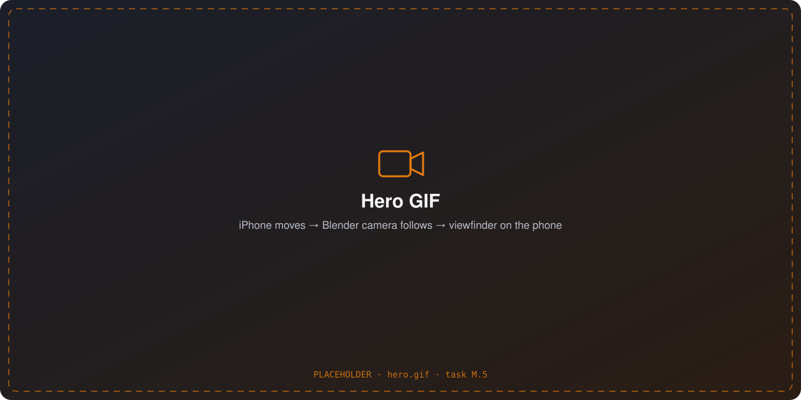
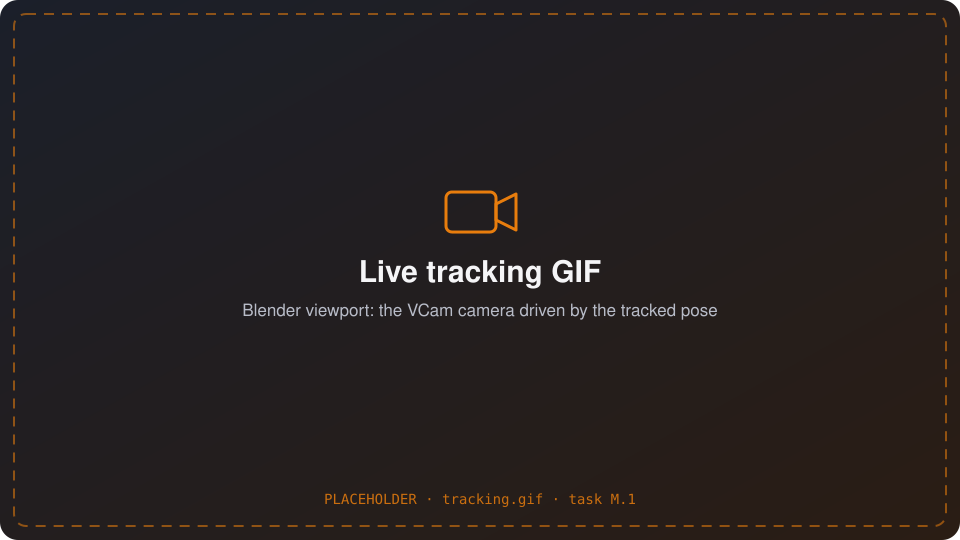
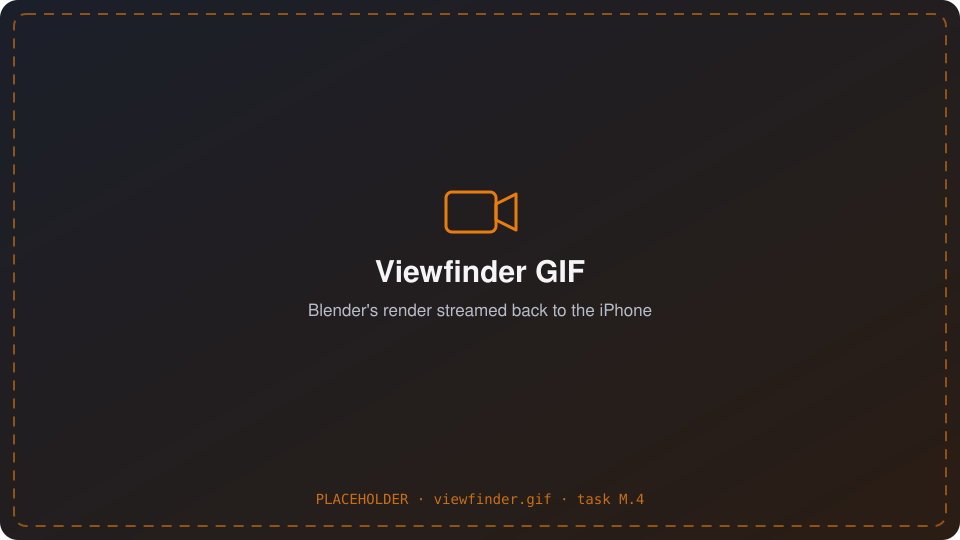
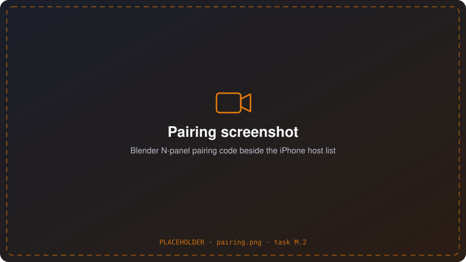
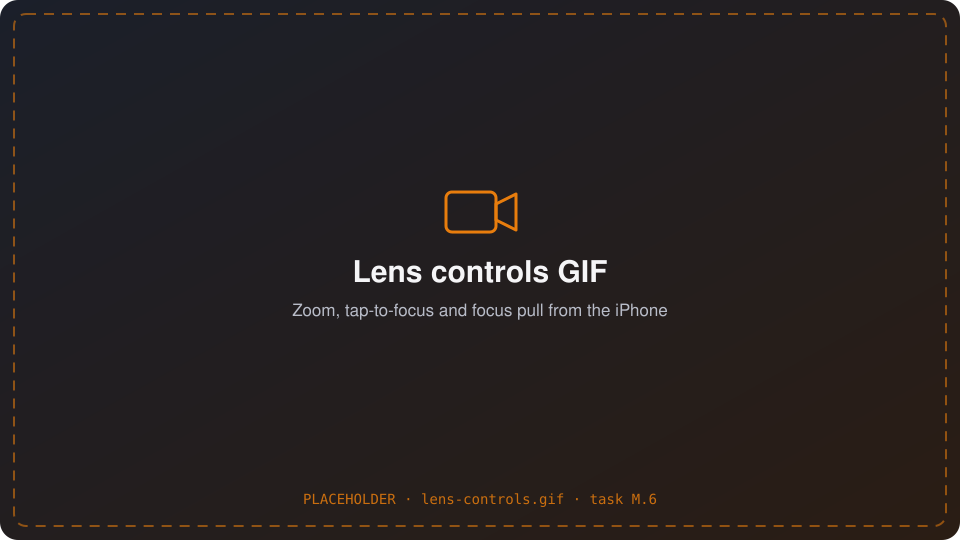
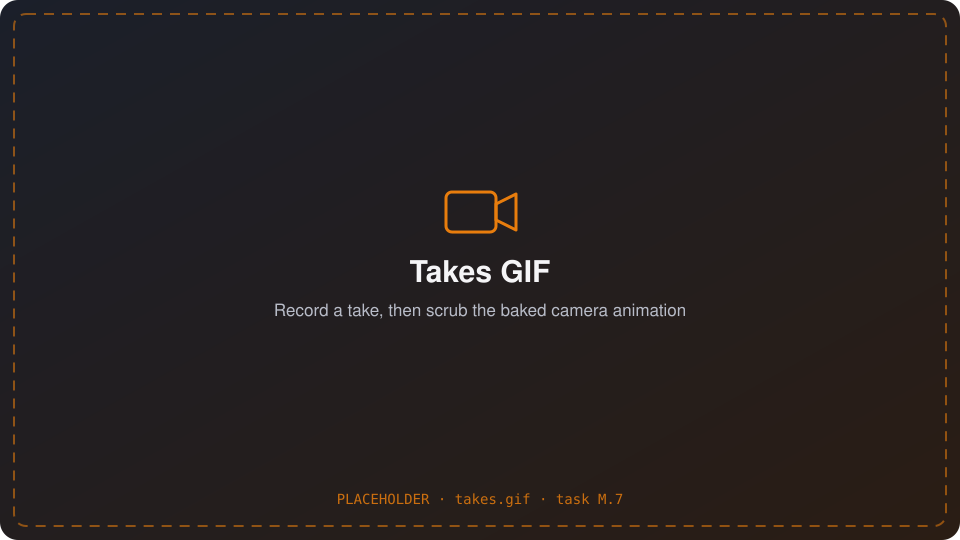
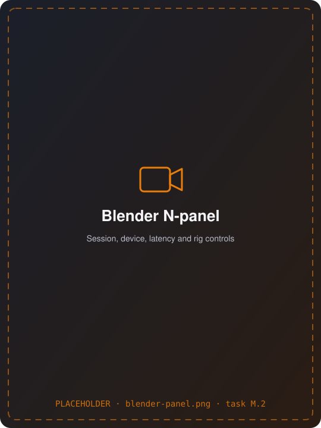
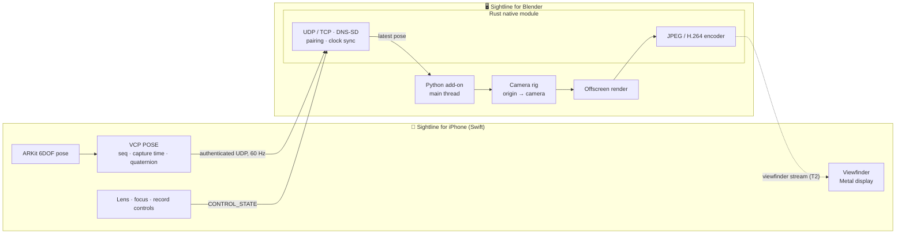
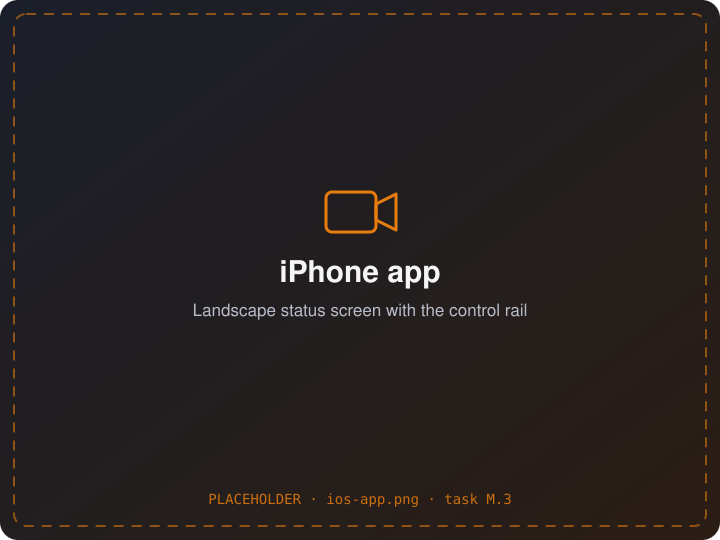

<div align="center">

<!-- TODO(M.8): replace with the project logo (docs/media/logo.svg) once one exists. -->
# 🎥 Sightline

### The open-source virtual camera for Blender

**iPhone tracking in, live viewfinder out.** Hold your phone like a camera and walk through your 3D scene. Blender's camera follows your hands, and Blender streams its view back to the phone, so the phone becomes your viewfinder.

[](https://github.com/0xkr4t0s/Sightline/actions/workflows/ci.yml)


[Why Sightline](#-why-sightline) · [Features](#-features) · [How it works](#-how-it-works) · [Roadmap](#-roadmap) · [Getting started](#-getting-started) · [Architecture](#-architecture) · [Contributing](#-contributing)

<br>

<!-- TODO(M.5): replace with docs/media/hero.gif, a split screen showing a hand moving the iPhone, the Blender camera following, and the phone's viewfinder. -->


</div>

> [!NOTE]
> **Early development.** Tracking (tier T1) is being built and tested in CI on all three desktop OSes. The streamed viewfinder (T2) and take recording (T3) are designed and benchmarked but not built yet. The [roadmap](#-roadmap) shows what works today.

---

## 💡 Why Sightline?

Filming a 3D scene with a real, handheld camera move is one of the fastest ways to make previs and animation feel alive. But most iPhone virtual cameras for Blender are **closed-source, paid apps**, and the open-source ones are Android-only, orientation-only, or send tracking one way with no viewfinder.

Sightline aims to be the complete, open alternative:

- **🔓 Fully open source.** The iPhone app, the Blender extension, the native core and the protocol are all open. No accounts, no subscriptions, no cloud.
- **📱 Full ARKit tracking.** Position and orientation (6DOF), not just a gyroscope, at 60 Hz, with the phone's capture time kept so motion lands at the right moment.
- **🖼️ A real viewfinder.** Blender renders from your tracked camera and streams it back to the phone, so you frame the shot on the phone instead of glancing at a monitor *(T2)*.
- **🖥️ Works everywhere Blender does.** Windows, macOS and Linux, each tested in CI with headless Blender and a simulated iPhone.
- **🔐 Secure by design.** Pair once with a 6-digit code (SRP-6a), and every packet is authenticated, so no one else on the Wi-Fi can move your camera.
- **📏 Measured, not guessed.** A shared clock between phone and computer turns latency into numbers: Blender saves p50/p95/p99 reports.
- **📖 An open protocol.** [VCP](docs/protocol/vcp.md) is documented byte by byte, with test vectors, so anyone can build another client, such as an Android app, an iPad director's monitor or a hardware rig.

---

## ✨ Features

<table>
<tr>
<td width="50%" valign="top">

### 📱 Handheld camera tracking
ARKit tracks the phone, and the pose drives a Blender camera in real time. You can set the origin, scale the motion (1:10 turns a living room into a stadium), lock axes, and smooth out hand shake.

<!-- TODO(M.1): replace with docs/media/tracking.gif -->


</td>
<td width="50%" valign="top">

### 🖼️ Live viewfinder *(T2, planned)*
Blender renders from the tracked camera and streams it back to the phone, full screen, with framing guides and a status HUD. The phone always shows the newest frame and never builds up a backlog.

<!-- TODO(M.4): replace with docs/media/viewfinder.gif -->


</td>
</tr>
<tr>
<td width="50%" valign="top">

### 🔐 Discovery and secure pairing
Blender advertises itself on your local network, so the phone lists it by computer and file name, with no IP addresses to type. You pair once with a 6-digit code, and the pairing is remembered.

<!-- TODO(M.2): replace with docs/media/pairing.png -->


</td>
<td width="50%" valign="top">

### 🔭 Lens and focus controls *(T2, planned)*
Change the focal length with a slider, a pinch or prime presets. Tap the screen to focus on an object, pull focus with a wheel, and use the phone's hardware buttons as camera controls.

<!-- TODO(M.6): replace with docs/media/lens-controls.gif -->


</td>
</tr>
<tr>
<td width="50%" valign="top">

### 🎬 Record takes *(T3, planned)*
Record a take while the scene plays. It bakes into a clean keyframed camera action at the scene's frame rate, and the raw data is kept so you can re-bake it with different smoothing.

<!-- TODO(M.7): replace with docs/media/takes.gif -->


</td>
<td width="50%" valign="top">

### 🧩 Feels native in Blender
Sightline installs like any Blender 5.2 extension and adds a *Sightline* tab to the sidebar. A bundled Rust module does the networking, clock sync and video encoding on its own threads, so Blender's UI stays responsive.

<!-- TODO(M.2): replace with docs/media/blender-panel.png -->


</td>
</tr>
</table>

---

## 🧭 How it works



1. **Track.** ARKit gives the phone's pose. The app converts it to a shared right-handed, Z-up coordinate frame and sends it as a timestamped `POSE` packet.
2. **Apply.** The Rust module receives each packet on its own thread, checks its authentication, drops stale ones and smooths the pose. On the main thread, Blender applies the newest pose to the camera under an origin rig that you can move, scale and lock.
3. **Render and stream** *(T2)*. Blender draws the camera's view offscreen. Rust encodes it and sends it back, and the phone shows the newest frame.

Everything travels over **VCP**, Sightline's own small binary protocol ([spec](docs/protocol/vcp.md)). Golden test vectors in [`testdata/`](testdata) keep the Swift, Rust and Python implementations byte-for-byte identical.

### Design choices

| | |
|---|---|
| ⚡ **Built for low latency** | One UDP datagram per pose, the newest pose always wins, and nothing is retransmitted. The phone never allocates memory while sending a pose (checked by a test). |
| 🕒 **Shared clock** | A clock sync maps the phone's capture time onto Blender's clock, so every latency figure is a measurement. |
| 🧵 **Blender stays responsive** | Sockets, threads and encoding live in Rust. Python touches `bpy` only on the main thread and never blocks while holding the GIL. |
| 🛡️ **Safe with network data** | The parsers never panic: `unwrap` is banned by lints, fuzz targets run in CI, and every packet's authentication is checked. |
| 🔒 **Private by default** | Blender opens ports only while a session is running. There's no analytics, and nothing leaves your local network. |

---

## 🗺️ Roadmap

| Tier | What you get | Status |
|---|---|---|
| **P0: Foundation** | A Rust module in a Blender extension, CI on 3 OSes, technical spikes | ✅ Done |
| **T1: Tracking** | Discovery, pairing, the phone's pose driving a Blender camera, rig controls, smoothing, latency reports | 🚧 In progress: the Blender side is done and tested with a simulated iPhone; the iPhone networking side is being finished |
| **T2: Viewfinder** | 960×540 @ 30 fps stream to the phone, lens and focus controls, hardware buttons | 📐 Designed and benchmarked |
| **T3: Production** | Take recording and baking, transport controls, H.264 streaming, false colour and zebras, signed releases, TestFlight | 📋 Planned |
| **T4: Extras** | FreeD / OpenTrackIO export, AR passthrough, iPad director's monitor, multiple cameras | 💡 Ideas |

Requirement-level status lives in [`IMPLEMENTATION_PROGRESS.md`](IMPLEMENTATION_PROGRESS.md).

---

## 🚀 Getting started

> [!IMPORTANT]
> There are no prebuilt releases yet, so for now you build from source. Signed builds and a TestFlight beta come with T3.

### Requirements

| | |
|---|---|
| Desktop | Blender **5.2 LTS** on Windows, macOS (Apple silicon) or Linux |
| Phone | iPhone or iPad with **iOS 26+** and ARKit (LiDAR helps but isn't required) |
| Network | Phone and computer on the same local network (5 GHz Wi-Fi recommended) |
| To build | Rust (stable, pinned in `native/rust-toolchain.toml`), [maturin](https://www.maturin.rs), Xcode 27 for the iOS app |

### 1. Build the Blender extension

```bash
# Build the Rust module as a wheel for Blender's bundled Python 3.13
maturin build --release -m native/vcam-py/Cargo.toml -o BlenderAddOn/wheels \
  -i "/Applications/Blender.app/Contents/Resources/5.2/python/bin/python3.13"

# Package the extension
blender --command extension build --source-dir BlenderAddOn --output-dir dist
```

In Blender, open **Edit → Preferences → Get Extensions → Install from Disk…** and choose the zip in `dist/`. The committed manifest lists only the macOS wheel. On Windows or Linux, update it with `python3 tools/set_manifest_wheels.py BlenderAddOn/blender_manifest.toml BlenderAddOn/wheels`, or take the zip CI builds for your platform.

### 2. Run the iPhone app

Open `SightlineIOS/SightlineIOS.xcodeproj` in Xcode, select your development team, and run it on a device. ARKit doesn't work in the Simulator.

### 3. Connect

1. In Blender, open the sidebar (`N`) → **Sightline** tab → **Start Sightline Session**.
2. On the phone, open **Settings**, pick your computer from the list, and enter the 6-digit code shown in Blender.
3. Press **Start** and move the phone.

<!-- TODO(M.3): replace with docs/media/ios-app.png -->
<p align="center"></p>

### Try it without an iPhone

`vcam-fake-iphone` behaves like the app: it pairs, opens a session and streams a scripted camera move. CI uses it to test the whole path in headless Blender.

```bash
cd native && cargo build --release -p vcam-fake-iphone
# Start a session in Blender first, then:
./target.nosync/release/vcam-fake-iphone --host 127.0.0.1:47000 \
  --state /tmp/fake-iphone.key --code <code shown in Blender> \
  --motion ../testdata/motion/scripted.bin
```

---

## 🏗️ Architecture

```
├── SightlineIOS/             Sightline for iPhone/iPad: Swift 6, ARKit, viewfinder, controls
├── BlenderAddOn/        Sightline for Blender 5.2 (Python 3.13): UI, camera rig, render loop
├── native/              Rust workspace, bundled into the extension as `vcam_native`
│   ├── vcam-protocol/   VCP messages, codec, HMAC, SRP-6a pairing, clock sync (no I/O)
│   ├── vcam-net/        sockets, DNS-SD, sessions, smoothing
│   ├── vcam-video/      JPEG and H.264 encoders behind one trait
│   ├── vcam-py/         PyO3 bindings
│   ├── vcam-fake-iphone/  a simulated iPhone used by the tests
│   └── fuzz/            cargo-fuzz targets for everything that parses network data
├── testdata/            golden vectors shared by Rust, Swift and Python
├── tests/blender/       headless Blender integration tests
└── docs/                requirements, implementation plan, protocol spec
```

Internal names still use `vcam` (the project's working title). They stay that way so installs, pairings and saved `.blend` files keep working.

| Layer | Tech |
|---|---|
| iPhone app | Swift 6 (strict concurrency), SwiftUI, ARKit, Network framework, CryptoKit |
| Blender extension | Python 3.13, `bpy`, `gpu` offscreen rendering |
| Native core | Rust, PyO3 + maturin, `mdns-sd`, SRP-6a, HKDF, HMAC-SHA256 |
| Video | JPEG (T2) → VideoToolbox / Media Foundation / VA-API H.264 (T3) |
| CI | GitHub Actions: fmt, clippy, tests and fuzzing; wheels for 3 OSes; headless Blender on 3 OSes; iOS unit tests |

### Testing

```bash
cd native && cargo fmt --check && cargo clippy --all-targets -- -D warnings && cargo test
pytest -q BlenderAddOn/tests
blender --background --factory-startup --python tests/blender/addon_apply.py
xcodebuild test -project SightlineIOS/SightlineIOS.xcodeproj -scheme SightlineIOS \
  -destination 'platform=iOS Simulator,name=iPhone 17 Pro'
```

---

## 🤝 Contributing

Sightline is built in the open, and contributions are welcome: code, testing on your hardware, docs or ideas.

- **Found a bug or have an idea?** [Open an issue](https://github.com/0xkr4t0s/Sightline/issues).
- **Want to write code?** Start with [`docs/IMPLEMENTATION_PLAN.md`](docs/IMPLEMENTATION_PLAN.md) and [`IMPLEMENTATION_PROGRESS.md`](IMPLEMENTATION_PROGRESS.md) to see what's next. Every change goes through a pull request, and CI must pass on all platforms.
- **Building your own client?** The [VCP spec](docs/protocol/vcp.md) and the vectors in [`testdata/`](testdata) are all you need, including for an Android app.

| Document | What's in it |
|---|---|
| [`docs/SRS.md`](docs/SRS.md) | Requirements, each with an ID, a priority and a tier, plus spike results (§13) |
| [`docs/IMPLEMENTATION_PLAN.md`](docs/IMPLEMENTATION_PLAN.md) | Phases, tasks, exit gates and the risk register |
| [`IMPLEMENTATION_PROGRESS.md`](IMPLEMENTATION_PROGRESS.md) | Status of every requirement, with evidence |
| [`docs/protocol/vcp.md`](docs/protocol/vcp.md) | The VCP wire protocol: byte layouts, pairing and examples |

## 📄 License

Sightline is open source, and every part of it will stay that way.

- **Blender extension** (`BlenderAddOn/` and its bundled native module): **GPL-3.0-or-later**, as Blender requires. See [`BlenderAddOn/LICENSE`](BlenderAddOn/LICENSE).
- **iPhone app** (`SightlineIOS/`): **Apache-2.0**. See [`SightlineIOS/LICENSE`](SightlineIOS/LICENSE). It contains no GPL code, so it can ship on the App Store.
- **Rust crates and protocol:** permissive licences (planned, being finalised), so anyone can build a compatible client.

<div align="center">
<br>
<sub>For filmmakers, previs artists and anyone who'd rather hold a camera than drag one around with a mouse.</sub>
</div>
