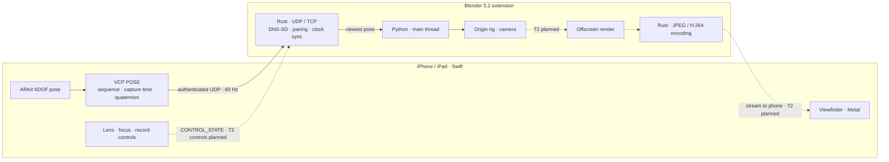

# Sightline

[](https://github.com/0xkr4t0s/Sightline/actions/workflows/ci.yml)

Sightline is an open-source iPhone/iPad virtual camera for Blender. ARKit tracks the phone's position and orientation; that pose drives a Blender camera. The phone camera is only a tracking sensor, not the image sent to Blender. The intended viewfinder is Blender's rendered camera view streamed *back* to the phone. There is no system webcam, account, subscription or cloud service.

**Current status: early development, no prebuilt releases.**

- **Working in CI:** the Blender 5.2 extension and Rust native module run on Windows, Linux and macOS. The Blender tracking path, rig controls and pairing are tested with a simulated iPhone; discovery has separate tests. The iOS app has VCP tracking and a status screen, not a video viewfinder.
- **In progress:** the complete T1 phone-to-Blender workflow still needs verification on real devices and networks. The simulated client is the reproducible way to exercise the tracking path for now.
- **Planned:** T2's streamed viewfinder is designed and benchmarked, but not built. T3 take recording and T4 extras are later work.

[Requirement-level progress](IMPLEMENTATION_PROGRESS.md) records what has been tested and what remains.

## Tracking and protocol

ARKit supplies 6DOF poses, typically at 60 Hz. The app converts them to a shared right-handed, Z-up frame and sends timestamped, sequenced `POSE` packets over authenticated UDP. The Rust module receives and checks them off Blender's main thread, drops stale poses and keeps the newest sample. Blender applies it on the main thread to a camera under a movable `VCam_Origin` rig. Origin reset, motion scale (including 1:10), axis locks and optional One-Euro smoothing are part of the T1 tracking path. The iPhone's capture time is retained for clock-synced pose latency reports (p50/p95/p99).

Blender advertises sessions on the local network. The phone lists hosts by computer and `.blend` file name; pairing uses a six-digit SRP-6a code and is remembered. Session keys authenticate packets. Sockets are open only during a session, and the application has no analytics. The Blender extension has a *Sightline* sidebar tab for the session, pairing code, camera and tracking status. Its Python code touches `bpy`/`gpu` only on the main thread; sockets and clock sync run in Rust without blocking Blender's UI. Encoding is also assigned to Rust, but production streaming isn't implemented yet.

VCP is Sightline's documented [binary protocol](docs/protocol/vcp.md), shared by the Swift, Rust and Python components through [golden vectors](testdata). Each pose uses one UDP datagram without retransmission; the latest pose wins. The iOS send path has an allocation test. Parsers are bounds-checked, `unwrap` is banned by Rust lints, and fuzz targets run in CI. A compatible client could also be built for Android or other hardware; Sightline does not have an Android app today.



The dashed video and T2 control paths are **not working features**. Blender offscreen readback and encoder options have been benchmarked on a Mac; the production renderer, stream, decode and phone display are still to come. The viewfinder is planned to show the newest frame full-screen with framing guides and a status HUD rather than queueing old frames.

## Roadmap

| Tier | Scope | Status |
|---|---|---|
| P0: Foundation | Rust module bundled in a Blender extension, three-OS CI, technical spikes | Done |
| T1: Tracking | Discovery, pairing, phone pose driving a Blender camera, rig controls, smoothing, latency reports | In progress; Blender side tested with a simulated iPhone, device workflow still being verified |
| T2: Viewfinder | 960×540 at 30 fps to the phone, focal-length slider/pinch/prime presets, tap-to-focus, focus wheel and hardware buttons | Designed and benchmarked; not built |
| T3: Production | Record takes while the scene plays; bake keyframes at scene frame rate and keep raw data for re-baking, transport controls, H.264 streaming, false colour/zebras, signed releases and TestFlight | Planned |
| T4: Extras | FreeD/OpenTrackIO export, AR passthrough, iPad director's monitor, multiple cameras, take repair (fill tracking gaps and smooth jumps after recording) | Ideas |
| Android | ARCore client using the same Blender extension and VCP | Help wanted; no app yet |

T2 intends to render Blender's tracked camera, encode on a Rust worker and display the latest decoded frame on the phone. Focal length would be adjustable by slider, pinch or prime preset; tapping an object would set focus, and a wheel would allow manual focus pulls. The phone's hardware buttons would act as camera controls. These are plans, not controls in the current status screen. T3's recording would produce a keyframed camera action while retaining the raw motion for different smoothing later. Neither the stream nor recording is available to users now. [The implementation plan](docs/IMPLEMENTATION_PLAN.md) has the exit gates; [progress](IMPLEMENTATION_PROGRESS.md) records what's actually complete.

## Build from source

There are no prebuilt releases yet. Signed builds and a TestFlight beta are part of T3.

- Desktop: Blender **5.2 LTS** on Windows, macOS (Apple silicon) or Linux.
- Device: an ARKit-capable iPhone or iPad on **iOS 26+**. LiDAR helps but isn't required. ARKit doesn't run in the Simulator.
- Network: phone and computer on the same local network; 5 GHz Wi-Fi is recommended.
- Build tools: stable Rust (toolchain in `native/rust-toolchain.toml`), [maturin](https://www.maturin.rs) and Xcode 27 for the iOS app.

Build a wheel for Blender's bundled Python 3.13, then package the extension:

```bash
maturin build --release -m native/vcam-py/Cargo.toml -o BlenderAddOn/wheels \
  -i "/Applications/Blender.app/Contents/Resources/5.2/python/bin/python3.13"
blender --command extension build --source-dir BlenderAddOn --output-dir dist
```

In Blender, use **Edit → Preferences → Get Extensions → Install from Disk…** and select the zip in `dist/`. The command above points at Blender's macOS Python; other platforms need the corresponding Blender Python 3.13 interpreter. The committed manifest lists only the macOS wheel. On Windows or Linux, update it with `python3 tools/set_manifest_wheels.py BlenderAddOn/blender_manifest.toml BlenderAddOn/wheels`, or use the platform zip produced by CI. A wheel built for the wrong interpreter or platform cannot be bundled as a substitute.

Open `SightlineIOS/SightlineIOS.xcodeproj` in Xcode, select your development team and run on a device. In Blender, open the sidebar (`N`) → **Sightline** → **Start Sightline Session**. In the app's **Settings**, select the host and enter the six-digit code shown in Blender; press **Start** and move the phone. This device path is still being verified, so use the simulated client for a reproducible tracking check.

`vcam-fake-iphone` pairs, opens a session and sends scripted pan, tilt, dolly and crane motion; CI runs it against headless Blender and checks the applied camera transforms. That checks the wire-to-camera path without depending on ARKit hardware or Wi-Fi. It does not establish that the real-device connection works. Start a Blender session before running it:

```bash
cd native && cargo build --release -p vcam-fake-iphone
./target.nosync/release/vcam-fake-iphone --host 127.0.0.1:47000 \
  --state /tmp/fake-iphone.key --code <code shown in Blender> \
  --motion ../testdata/motion/scripted.bin
```

## Source and testing

- `SightlineIOS/`: Swift 6 (strict concurrency), SwiftUI, ARKit, Network framework and CryptoKit. The status screen currently has no video.
- `BlenderAddOn/`: Blender 5.2 Python 3.13 extension; sidebar, camera rig and (planned) `gpu` offscreen rendering.
- `native/`: Rust workspace bundled as `vcam_native` via PyO3/maturin. `vcam-protocol` contains VCP messages, HMAC, SRP-6a pairing and clock logic without I/O; `vcam-net` handles sockets, DNS-SD, sessions and smoothing; `vcam-video` is for JPEG and H.264 encoders; `vcam-py` exposes the native module; `vcam-fake-iphone` is the simulated client. `native/fuzz/` contains parser fuzz targets.
- `testdata/` holds vectors shared by Rust, Swift and Python; `tests/blender/` holds headless integration checks. The superseded C++ receiver is in `legacy/` and is being retired. Internal `vcam` identifiers remain for compatibility with installs, pairings and saved files.

JPEG is the planned T2 video format; VideoToolbox, Media Foundation and VA-API H.264 are in the T3 plan. CI runs formatting, Clippy, tests and fuzzing; builds wheels and runs headless Blender on three desktop OSes, plus iOS unit tests. For local checks:

```bash
cd native && cargo fmt --check && cargo clippy --all-targets -- -D warnings && cargo test
pytest -q BlenderAddOn/tests
blender --background --factory-startup --python tests/blender/addon_apply.py
xcodebuild test -project SightlineIOS/SightlineIOS.xcodeproj -scheme SightlineIOS \
  -destination 'platform=iOS Simulator,name=iPhone 17 Pro'
```

## Contributing

Bug reports, code, documentation and hardware testing are welcome through [issues](https://github.com/0xkr4t0s/Sightline/issues) and pull requests. Check the [requirements](docs/SRS.md), [plan](docs/IMPLEMENTATION_PLAN.md) and [progress](IMPLEMENTATION_PROGRESS.md) before picking up work; changes go through CI on all platforms. Client authors can use the [VCP spec](docs/protocol/vcp.md) and [vectors](testdata).

Help is particularly useful in a few areas:

- An Android ARCore client speaking VCP and passing the shared vectors. The Blender side should not need an Android-specific transport. An Android developer would need to lead this work.
- Windows and Linux render/encode benchmarks on a mid-range GPU. Measurements so far are from a Mac; see [SRS §13.1–13.2](docs/SRS.md) for results and [`tests/bench_render.py`](tests/bench_render.py) for the render benchmark recipe. This helps choose defaults for the other platforms.
- T4 take repair: fill gaps where Wi-Fi dropped poses and smooth tracking jumps after recording, while preserving the raw data.
- Optional FreeD/OpenTrackIO exports for studio pipelines. These are not part of the T1 tracking protocol.

## License

- Blender extension (`BlenderAddOn/`): **GPL-3.0-or-later** ([license](BlenderAddOn/LICENSE)). The native module it bundles is built from the Apache-2.0 Rust crates below, which are GPL-compatible.
- iOS app: **Apache-2.0** ([license](SightlineIOS/LICENSE)); it contains no GPL code and can ship on the App Store.
- Rust crates (`native/`), the VCP protocol spec and golden vectors (`docs/protocol/`, `testdata/`), tools and tests: **Apache-2.0** ([license](LICENSE)).
